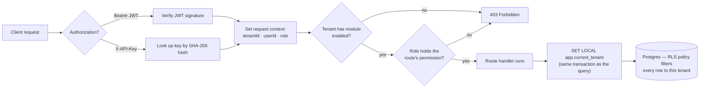
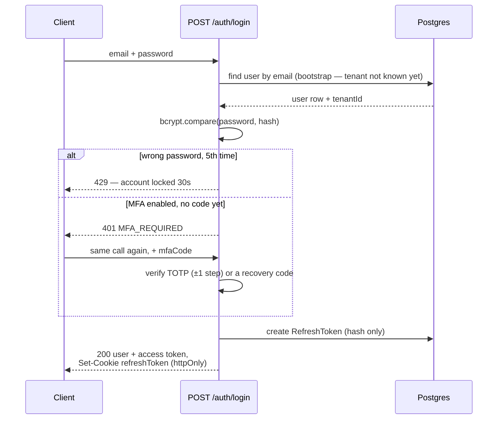
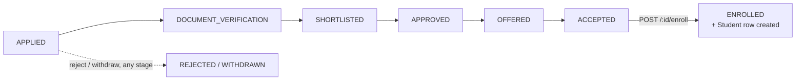
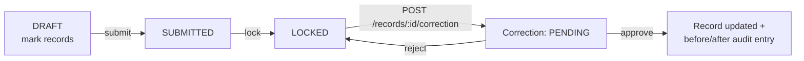
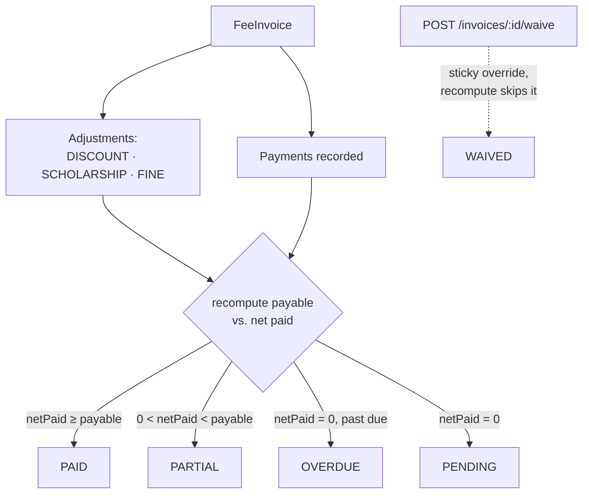
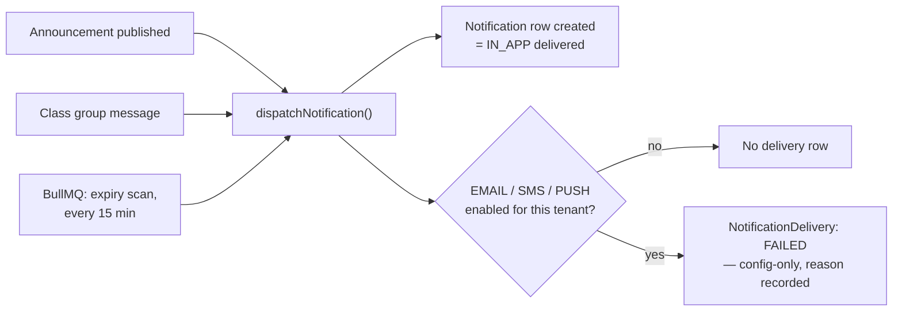
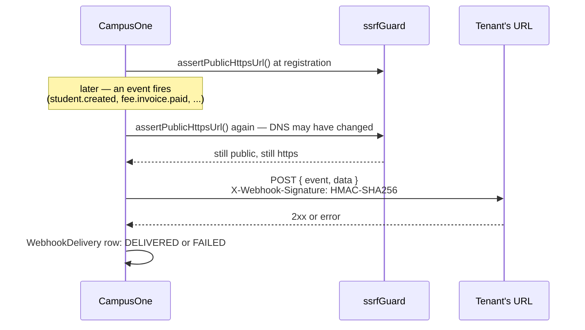

# The CampusOne Handbook

CampusOne is the backend for a multi-tenant college-management SaaS — one API, any number of colleges, each seeing only its own students, faculty, and ledgers. This handbook is the map: how a request finds its tenant, how a role becomes a permission, and how the flows that matter most actually move through the system.

For the full request/response reference for every route, see the interactive spec: run the API and open **`/api/docs`** (Swagger UI), or read the source at [`docs/openapi.yaml`](./openapi.yaml).

| | | | |
|---|---|---|---|
| **38** modules | **255** endpoints | **10** system roles | **1** database, RLS-isolated |

---

## 1. Architecture

Every college that signs up is a **tenant**. There's one Postgres database and one schema — not one database per college — so isolation has to be enforced by the database itself, not just remembered in application code. That's the single decision everything else in this handbook traces back to.

### Tenants & Row-Level Security

Every table carries a `tenantId` column, and Postgres **Row-Level Security** is the last line of defense — not an optional extra. A request's JWT resolves to a tenant, that tenant id is carried through the request via `AsyncLocalStorage`, and a Prisma client extension sets `app.current_tenant` before every single query, inside the same transaction as the query itself. A query that somehow runs with no tenant context set doesn't silently see everything — it throws.



*Fig. 1 — what happens between a request arriving and a row of data coming back. Module and permission checks are two separate gates — a tenant can hold a valid role for a feature it hasn't paid for.*

### Roles, permissions, and modules

Roles aren't a hardcoded enum — `Role`, `Permission`, and `RolePermission` are ordinary database rows, seeded per tenant. A route never checks *"is this user a HOD"* — it checks *"does this role hold `STUDENT_READ`,"* which means the grants underneath a role name can change without touching a single line of route code. Ten system roles ship by default, from the cross-tenant `PLATFORM_ADMIN` down to `STUDENT` and `PARENT`.

Orthogonal to roles: **modules**. `CORE` is always on; everything else — `ACADEMICS`, `FINANCE`, `HOSTEL_TRANSPORT`, and so on — is a row in `TenantModule` a college can be sold, or not. A route checks both: the module gate first, then the permission.

---

## 2. Getting started

Five steps stand between a fresh clone and your first authenticated call.

### 1. Bring up Postgres, Redis, and the schema

Docker Compose creates the non-superuser `campusone_app` role RLS actually depends on.

```bash
docker compose up -d
npm install
npm run prisma:migrate   # applies the schema + RLS policies
npm run prisma:seed      # permission catalogue + demo tenant/admin
npm run dev
```

### 2. Log in as the seeded demo admin

Every tenant needs a resolvable email — that's why login looks a user up by email before it knows the tenant.

```bash
curl -X POST http://localhost:4000/api/v1/auth/login \
  -H "Content-Type: application/json" \
  -d '{"email":"admin@demo-college.test","password":"Passw0rd!"}'

# 200 →
{ "user": { "role": "SUPER_ADMIN", "mfaEnabled": false, "..." : "..." }, "token": "eyJhbGci..." }
```

### 3. Call an endpoint with the token

Every list route returns the same envelope, so pagination works identically everywhere.

```bash
curl http://localhost:4000/api/v1/departments \
  -H "Authorization: Bearer $TOKEN"

# 200 →
{ "data": [ { "name": "Computer Science", "code": "CSE" } ],
  "meta": { "page": 1, "pageSize": 10, "total": 4, "totalPages": 1 } }
```

### 4. Read an error the same way everywhere

One shape for every non-2xx response — a machine code to branch on, a message to show.

```bash
curl -X POST http://localhost:4000/api/v1/departments \
  -H "Authorization: Bearer $TOKEN" -d '{"name":"CSE"}'

# 409 →
{ "message": "Code \"CSE\" is already in use.", "code": "DUPLICATE_CODE" }
```

### 5. Browse the rest interactively

Everything past this point — all 38 modules — is documented request-by-request in Swagger.

```bash
open http://localhost:4000/api/docs
```

---

## 3. Auth & MFA

Access is a short-lived JWT; refresh is an opaque token in an httpOnly cookie, stored only as a SHA-256 hash, rotating on every use. MFA is TOTP (RFC 6238) — when it's on, a missing or wrong code fails the *same* `POST /login` call before any token is issued, rather than a separate challenge step.



*Fig. 2 — the client never sees a separate "MFA challenge" resource; it just resubmits the login call with `mfaCode` filled in.*

> **API keys work differently on purpose.** An `X-API-Key` header authenticates *as the user who created it* — same tenant, same role, same permission checks — rather than carrying its own separate scope system. One less authorization model to keep in sync.

---

## 4. Core flows

Five flows that show the shape of the rest: a lifecycle that ends in a new row elsewhere in the system, a ledger that recomputes itself, a state machine that refuses direct edits once locked, and two ways data leaves the system — to a user's own notification list, and to a URL the tenant supplied.

### Admissions → enrollment

An application steps forward one stage at a time through `/advance`. `ENROLLED` is reachable only through its own endpoint — the one action that actually creates a `Student` row, through the exact same path a manual entry uses.



*Fig. 3 — `/advance` only ever moves one step; only `/enroll` can reach `ENROLLED`.*

### Attendance: lock, then only correct

The roadmap's own flagship example of "not just CRUD." Once a session is `LOCKED`, a record can never be edited directly again — only challenged with a correction request, which an approval turns into an audited before/after change.



*Fig. 4 — no route exists to edit a locked record directly; the correction workflow is the only door.*

### Fees: a recomputed ledger, not a stored balance

An invoice's `status` is never trusted as stored truth — it's recomputed from every payment and adjustment on every write, the same way SGPA/CGPA are computed on read elsewhere. A waiver is the one sticky manual override the recompute leaves alone.



*Fig. 5 — an internal ledger by design; no live payment gateway is wired up, so payments are admin-recorded.*

### Notifications: one real channel, two honest stubs

Three things fire a notification: an announcement going live, a class-group message, and a BullMQ job that scans every tenant every 15 minutes for announcements about to expire. `IN_APP` is always real. `EMAIL`, `SMS`, and `PUSH` only even attempt a delivery if the tenant has switched the matching integration on — and even then, nothing actually sends; the delivery is logged `FAILED` with the reason why, rather than pretending to succeed.



*Fig. 6 — a `FAILED` row with a reason beats a silent no-op; anyone querying deliveries sees exactly what didn't happen and why.*

### Webhooks: signed, and checked twice

A tenant-supplied URL that this server POSTs to is a real SSRF vector, not a hypothetical one — so it's checked against `ssrfGuard` both when it's registered *and* again immediately before every delivery, which is what actually defends against DNS being rebound to a private address in between.



*Fig. 7 — no retry queue yet; one inline attempt per event, logged either way.*

---

## 5. Module reference

Every route sits behind two gates: a **module** the tenant must have enabled, and a permission the caller's role must hold. This is the index; full request/response bodies are in Swagger.

| Module | Gate | What it's for |
|---|---|---|
| Departments | `CORE` | The academic org chart everything else hangs off. |
| Students | `CORE` | The core roster — profile, department, section, status. |
| Dashboard | `CORE` | Read-only summary counts, enrollment trend, activity feed. |
| Academic Years / Programs / Batches / Sections / Subjects | `CORE` | The hierarchy a student sits inside: year → program → batch → section → subject. |
| Faculty | `CORE` | Employee profile *and* login account, created together. |
| Rooms | `CORE` | Flat room catalogue — no building/floor hierarchy. |
| Timetable | `ACADEMICS` | Weekly schedule with faculty/room/section conflict detection. |
| Institution | `CORE` | Singleton tenant settings — name, brand color. |
| RBAC | `CORE` | Read roles/permissions; assign a user's role. |
| Audit Logs | `CORE` | Every mutation, written automatically, admin-only to read. |
| Attendance | `ACADEMICS` | Session lock + correction/approval — see Fig. 4. |
| Leave | `ACADEMICS` | Requests that, once approved, write back into Attendance. |
| Assignments | `ACADEMICS` | Draft → publish → close, with submissions and grading. |
| Examinations | `EXAMINATION` | Exam → schedule → marks (draft→submit→verify→publish) → SGPA/CGPA. |
| Announcements | `COMMUNICATION` | Scoped to college / department / program / batch / section — see Fig. 6. |
| Documents | `CORE` | Generic verified-document metadata (`fileUrl` is a reference, no upload). |
| Reports | `CORE` | Read-only aggregations — strength, attendance, performance, financials, dropout. |
| Import / Export | `CORE` | Student CSV — preview, commit, export. |
| Admissions | `ADMISSIONS` | Applicant lifecycle through enrollment — see Fig. 3. |
| Fees | `FINANCE` | Internal invoicing ledger — see Fig. 5. |
| Hostel / Transport | `HOSTEL_TRANSPORT` | Room and route allocation, with capacity checks. |
| Library | `LIBRARY` | Issue/return with computed late fines. |
| Certificates | `CORE` | Issuance workflow with a publicly verifiable code. |
| Activities | `CORE` | Achievements, events, clubs — student self-reported or staff-logged. |
| Placements | `PLACEMENT_ALUMNI` | Companies → openings → applications, CGPA-gated. |
| Billing | `CORE` | The tenant's own subscription against a seeded plan catalogue. |
| API Keys | `CORE` | Authenticate as their creator — see §3. |
| Webhooks | `CORE` | SSRF-guarded, signed outbound events — see Fig. 7. |
| Integrations | `CORE` | Config only — enabling one never places a live call. |
| Approvals | `CORE` | A minimal generic approve/reject primitive for future features. |
| Notifications | `CORE` | Self-account inbox — see Fig. 6. |
| Class Groups | `CORE` | Every Section's own message board — membership derived, not stored. |

---

## 6. Conventions & errors

**Every list looks the same:**

```json
{
  "data": [ ],
  "meta": { "page": 1, "pageSize": 10, "total": 42, "totalPages": 5 }
}
```

**Every error looks the same:**

```json
{ "message": "Human-readable", "code": "DUPLICATE_CODE", "details": {} }
```

**Status codes in practice:**

| Code | Meaning here |
|---|---|
| `401` | Bad credentials, expired session, or — distinctly — `MFA_REQUIRED` / `MFA_INVALID`. |
| `403` | A module name in the message means the tenant hasn't enabled it; otherwise it's a permission gap. |
| `409` | A domain conflict — `DUPLICATE_CODE`, `ALREADY_PAID`, `ROOM_FULL`, and so on, one per module. |
| `422` | `VALIDATION_ERROR` — Zod rejected the body before it reached any business logic. `details` is a field → messages map. |
| `429` | Rate limit — tighter on `/auth/login` and `/auth/refresh` specifically. |

---

*Generated from the live route set and Zod schemas in this repo. The source of truth is [`docs/openapi.yaml`](./openapi.yaml) (served at `/api/docs`) and [`README.md`](../README.md) — if this page and either of those ever disagree, they win.*
